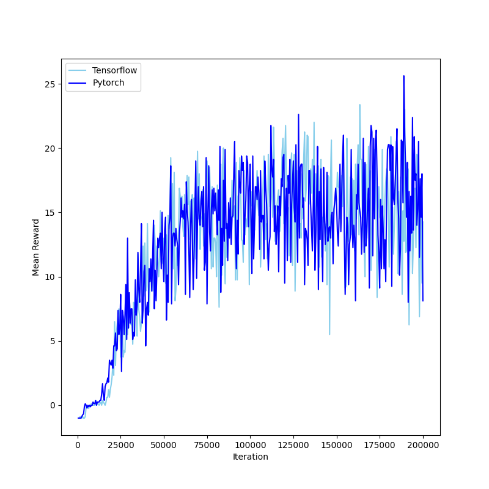
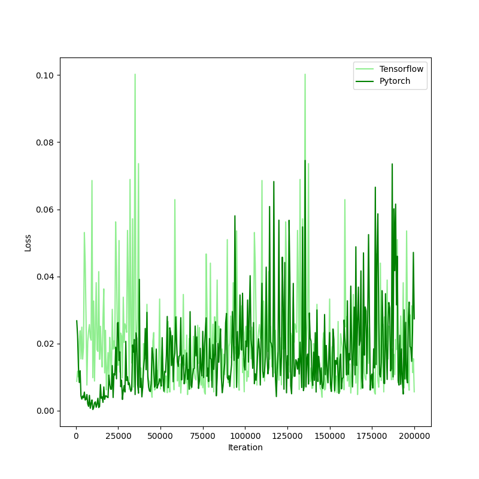

## How to run the project

- ###### run [training](./training.py) to train the model yourself

- ###### run [visualize](./game_visualization.py) to create gameplay from the newest model

- ###### run [plots](./comparison_plots.py) to plot the graphs below

## Comparison to Tensorflow Model

|  |  |   |
|------------------------------|------------------------------|---|

